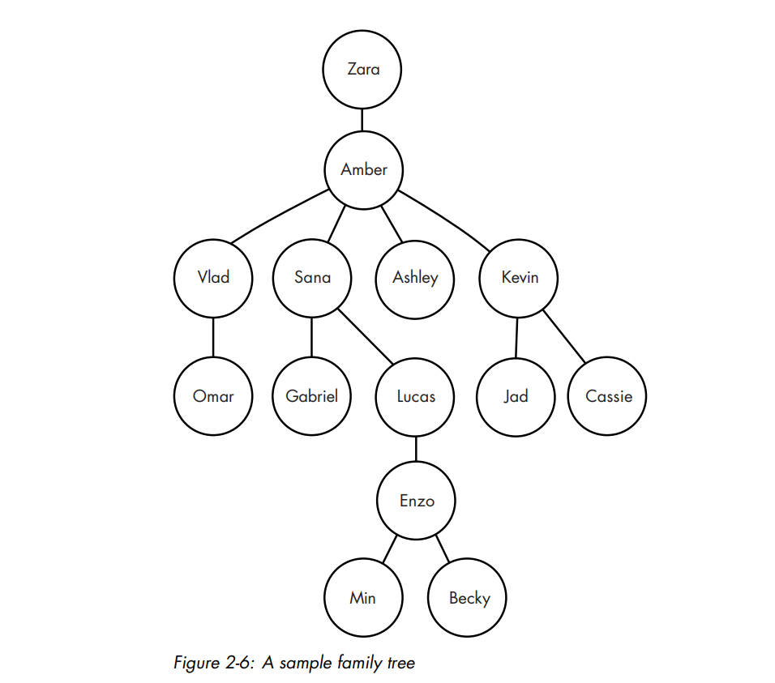

# Problem 2: _Descendant Distance_

### The problem

We are given a family tree and a specified distance _**d**_. The score for each node is the number of descendants it has
at distance _**d**_. Our task is to output the nodes with high scores; I'll explain exactly how many nodes that is in
the Output section.



Consider the Amber node. Amber has four children, so she has four descendants at a distance of one. Amber also has five
grandchildren: five nodes at a distance two. Generalizing, we can say that, for any node, the number of descendants at a
distance _**d**_ is the number of nodes that are exactly _**d**_ edges down the tree from that node.

---
#### Input
The first line of input gives the number of test cases that will follow. Each test case consists of the following lines:
- A line containing two integers _**n**_ and _**d**_. _**n**_ tells us how many more lines there are for this test case.
_**d**_ specifies the descendant distance of interest.
- _**n**_ lines used build the tree. Each of this lines consists of the name of a node, an integer _**m**_, and m node
names giving the children of this node. Each name is at most 10 characters long. These lines can came in any order - 
there's no requirement that parents are listed before their children.

There are at most 1,000 nodes in any test case.

Here is the possible input that would generate the sample tree in Figure 2-6, asking for the nodes with the most
descendants at a distance of two:
---

```
1
7 2
Lucas 1 Enzo
Zara 1 Amber
Sana 2 Gabriel Lucas
Enzo 2 Min Becky
Kevin 2 Jad Cassie
Amber 4 Vlad Sana Ashley Kevin
Vlad 1 Omar
```

---
#### Output
The output for each test case has two parts.  
&nbsp;&nbsp; First, the following line is output:
---

`Tree i`

---

where _i_ is 1 for the first test case, 2 for the second test case, and so on.  
&nbsp;&nbsp; Then, names with high scores are output (where the score for a node is the number of descendants it has at
distance _**d**_), sorted from most to least. Names that are tied for the number of descendants at distance _**d**_ are
output in alphabetical order.  
&nbsp;&nbsp; Use the following rules to determine how many names to output:
- If there are three or fewer names with descendants at distance _**d**_, output them all.
- If there are more than three names with descendants at distance _**d**_, start by outputting top tree. Call those
names _**n1**_, _**n2**_, and _**n3**_, sorted from most to least. Then, output each other name whose score is the same
as _**n3**_. For example, if we have names with eight, eight, five, five, five, two, and two descendants at distance
_**d**_, we would output information for five names: those with eight, eight, five, five, and five descendants at
distance _**d**_.  
&nbsp;&nbsp; For each name that we're required to output, we output a line consisting of the name, followed by a space,
followed by its number of descendants at distance _**d**_.  
&nbsp;&nbsp; Output for each test case is separated from the next by a blank line.  
&nbsp;&nbsp; Here is the output for the above sample input:

---

```
Tree 1:
Amber 5
Zara 4
Lucas 2
```

---
