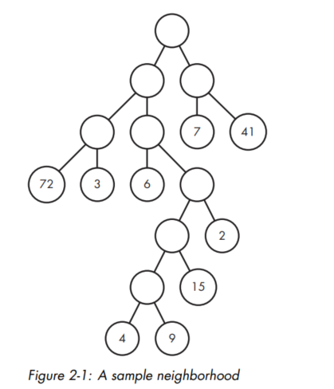

# Problem 1: _Halloween Haul_

### The problem

Consider this: it's Halloween, a holiday that often involves getting dressed up, candy from neighbours, and stomachache.
In this problem, you want to collect all the candy from a particular neighbourhood as efficiently as possible. The
neighbourhood has a rigid though strange shape. Figure 2-1 shows a sample neighbourhood.  

&nbsp;&nbsp; The circles with numbers in them are houses. Each number gives the amount of candy you'll get by visiting
that house. Candy values are at most two digits. The circle at the top is your starting location. The circles without
numbers are intersections between streets, where you choose which way to walk next. The lines that connect circles are
the streets. Moving from one circle to another corresponds to walking one street.  
&nbsp;&nbsp; Let's think about how you could move through this neighbourhood. Begin at the top circle. If you walk down
the street on the right, you get to an intersection. If you then walk down the street on the right from that circle, you
end up at a house and collect 41 pieces of candy. You could then walk back up the streets to the top to return to your
starting location. You'll have thus walked a total of four streets and collected 41 pieces of candy.  
&nbsp;&nbsp; However, your is to collect all of the candy and to do so by walking the minimum number of streets. You're
allowed to end your walk as soon as you've collected all of the candy; there's no requirement to get back to the top
circle.

---
#### Input
The input consists of exactly five lines, where each line is a string of at most 255 characters that describes a 
neighborhood.  
&nbsp;&nbsp; How can a string encode a diagram? This isn’t like the Unique Snowflakes problem from Chapter 1, where each
snowflake was just six integers. Here we have circles, lines connecting circles, and candy values in some of those
circles.  
&nbsp;&nbsp; As with the [Unique Snowflakes](/chapter_1/hash_tables/unique_snowflakes) problem, we can simplify things
by initially ignoring some of the complexities of the full problem. For that reason, I’ll defer the way that the input
is provided until later. Here’s a teaser, though: there’s a quite clever and compact way to represent these diagrams as
strings. Stay tuned

---
#### Output
Our output will be five lines of text, with each line corresponding to one of the five input lines. Each line of output
contains two integers separated by a space: the minimum number of streets walked to obtain all of the candy and the
total amount of candy obtained.
